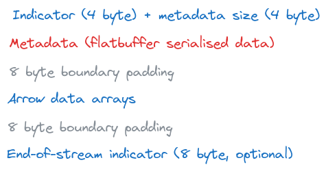
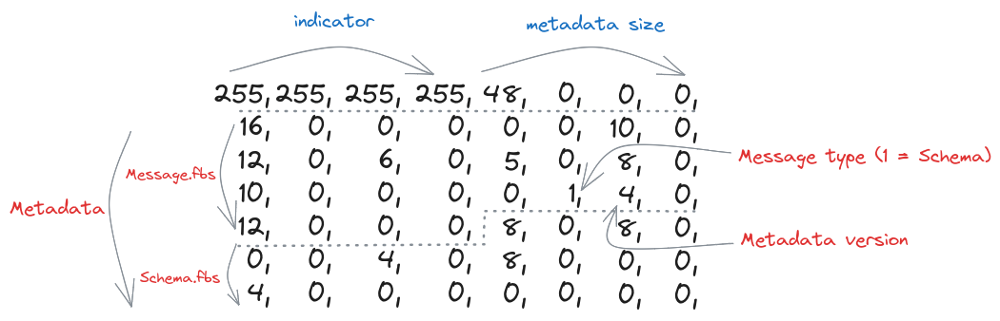
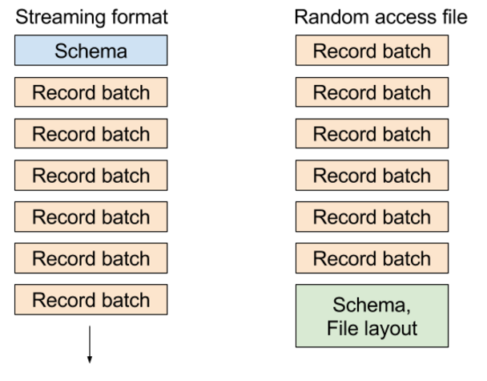

# Apache Arrow IPC

**<em>TIL</em>**: *How to serialize data with Apache Arrow*

The Apache Arrow project uses the Arrow IPC message format for communication of Arrow columnar data across processes and machines. The format relies on [Flatbuffers](https://flatbuffers.dev/) to serialize schemas and other metadata, but uses the Arrow columnar representation for transmitting the actual data arrays. This TIL describes in reasonable detail how to construct valid Arrow IPC messages. It is based on material from the official [documentation](https://arrow.apache.org/docs/format/Columnar.html#serialization-and-interprocess-communication-ipc).

## Encapsulated Binary Message Format

Arrow defines an encapsulated binary message format as being composed of bit flags, Flatbuffer serialised metadata, Arrow data arrays and padding. More precisely, an encapsulated binary message is structured according to the following sequence:



*The Arrow encapsulated binary message format*

The Flatbuffer definition files are available from the Arrow [repository](https://github.com/apache/arrow/tree/main/format). As of October 2023, the relevant files are `Message.fbs`, `Schema.fbs`, `Tensor.fbs` and `SparseTensor.fbs`. These files contain all the definitions that are required for serialising schemas and metadata for the IPC format. The definitions can be extended (`Tensor.fbs` and `SparseTensor.fbs` were created in this way) but the format should remain backwards compatible.

Perhaps the simplest example of such a binary message is produced by serialising a 'null' schema. This schema has no column names or data types. The binary payload for this message looks like:



*Binary payload for the 'null' schema*

I will only highlight the parts of this binary message that are particularly relevant to the encapsulated message format (for more details on Flatbuffers, root tables and vtables see [here](https://github.com/mzaks/FlatBuffersSwift/wiki/FlatBuffers-Explained)). The first 8 bytes contain the bit flag to indicate the start of the message as well as the total size of the metadata in bytes. The remaining 48 bytes contain information that has been derived from the `Message.fbs` and `Schema.fbs` files. Byte 29 is important as it indicates that the subsequent binary payload has been produced using the 'Schema' message type (see the `MessageHeader` type in `Message.fbs` for more details). Byte 30 is important as it indicates the version of the format to use.

To produce this binary message from scratch, it's necessary to first compile the Flatbuffers definition files using the [`flatc`](https://flatbuffers.dev/flatbuffers_guide_building.html) schema compiler. I did this for Python and reproduced the binary message using the following code:

```python
import flatbuffers
from org.apache.arrow.flatbuf import Message, Schema

# Serialising: pyarrow.schema([])

builder = flatbuffers.Builder(1024)

# construct Schema - see Schema.fbs
Schema.SchemaStartFieldsVector(builder, 0)
field = builder.EndVector()
Schema.SchemaStart(builder)
Schema.SchemaAddFields(builder, field)
Schema.SchemaAddEndianness(builder, 0)
schema = Schema.SchemaEnd(builder)

# construct Message - see Message.fbs
Message.MessageStart(builder)
Message.MessageAddHeader(builder, schema)
Message.MessageAddVersion(builder, 4)
Message.MessageAddHeaderType(builder, 1)
message = Message.MessageEnd(builder)
builder.Finish(message)
```

## Streaming Protocol

(**Note:** *The following two paragraphs are taken directly from the Arrow IPC documentation*)

The streaming protocol is presented as a sequence of encapsulated messages. The *schema encapsulated message* comes first in the stream, and it follows the format outlined above. The schema is the same for all of the encapsulated messages that follow. If any fields in the schema are dictionary-encoded, one or more DictionaryBatch messages will be included. DictionaryBatch and RecordBatch messages may be interleaved, but before any dictionary key is used in a RecordBatch it should be defined in a DictionaryBatch.

```
<SCHEMA>
<DICTIONARY 0>
...
<DICTIONARY k - 1>
<RECORD BATCH 0>
...
<DICTIONARY x DELTA>
...
<DICTIONARY y DELTA>
...
<RECORD BATCH n - 1>
<EOS [optional]: 0xFFFFFFFF 0x00000000>
```
When a stream reader implementation is reading a stream, after each message, it may read the next 8 bytes to determine both if the stream continues and the size of the message metadata that follows. The stream writer can signal end-of-stream (EOS) either by writing 8 bytes containing the 4-byte continuation indicator (0xFFFFFFFF) followed by 0 metadata length (0x00000000) or closing the stream interface. We recommend the “.arrows” file extension for the streaming format although in many cases these streams will not ever be stored as files.

**Arrow IPC involves creating a series of encapsulated binary messages and then sending them in the order outlined by the streaming protocol.**

### An example

I will attempt to explain the streaming protocol in more detail by serialising an Arrow array containing a single `int32` value, and whose column name is `my_column_name`. To do this, I first have to produce a schema message. The code for this is similar to the code at the beginning of this TIL (but note that here the binary payload needs to be padded with an extra 4 bytes to match the Arrow encapsulated message format definition):

```python
from org.apache.arrow.flatbuf import Field, Int

# Serialising: pa.schema([('my_column_name', pa.int32())]) 

builder = flatbuffers.Builder(1024)

# construct Schema
Int.IntStart(builder)
Int.IntAddBitWidth(builder, 32)
Int.IntAddIsSigned(builder, True)
int_type = Int.IntEnd(builder)
column_one = builder.CreateString('my_column_name')
Field.FieldStartChildrenVector(builder, 0)
child = builder.EndVector()
Field.FieldStart(builder)
Field.FieldAddChildren(builder, child)
Field.FieldAddType(builder, int_type)
Field.FieldAddName(builder, column_one)
Field.FieldAddTypeType(builder, 2)
Field.FieldAddNullable(builder, True)
array_field = Field.FieldEnd(builder)
Schema.SchemaStartFieldsVector(builder, 1)
builder.PrependUOffsetTRelative(array_field)
field = builder.EndVector()
Schema.SchemaStart(builder)
Schema.SchemaAddFields(builder, field)
Schema.SchemaAddEndianness(builder, 0)
schema = Schema.SchemaEnd(builder)

# construct Message
Message.MessageStart(builder)
Message.MessageAddHeader(builder, schema)
Message.MessageAddVersion(builder, 4)
Message.MessageAddHeaderType(builder, 1)
message = Message.MessageEnd(builder)
builder.Finish(message)

# 4 bytes should be appended to end of message to achieve 8 byte boundary
```

Next, I need to produce a record batch message. This message is then followed by the actual data arrays in the Arrow format: 
```python
from org.apache.arrow.flatbuf import Buffer, FieldNode, RecordBatch

# Serialising: pyarrow.record_batch([pyarrow.array([1,], type=pyarrow.int32()),], names=['my_column_name'])

builder = flatbuffers.Builder(1024)

# construct RecordBatch
RecordBatch.RecordBatchStartNodesVector(builder, 1)
FieldNode.CreateFieldNode(builder, 1, 0)
node = builder.EndVector()
RecordBatch.RecordBatchStartBuffersVector(builder, 2)
Buffer.CreateBuffer(builder, 0, 4)
Buffer.CreateBuffer(builder, 0, 0)
buffer = builder.EndVector()
RecordBatch.RecordBatchStart(builder)
RecordBatch.RecordBatchAddLength(builder, 1)
RecordBatch.RecordBatchAddBuffers(builder, buffer)
RecordBatch.RecordBatchAddNodes(builder, node)
record_batch = RecordBatch.RecordBatchEnd(builder)

# construct Message
Message.MessageStart(builder)
Message.MessageAddBodyLength(builder, 8)
Message.MessageAddHeader(builder, record_batch)
Message.MessageAddVersion(builder, 4)
Message.MessageAddHeaderType(builder, 3)
message = Message.MessageEnd(builder)
builder.Finish(message)

# Arrow data array (padded to 8 bytes) appended to end of message - 1,0,0,0,0,0,0,0 in this example
```

Streaming columnar data can be an efficient way to transmit large datasets to columnar analytics tools using small chunks. Data services using row-oriented storage can transpose and stream small data chunks that are more friendly to your CPU’s L2 and L3 caches and your machine's RAM. 

**Unexpected TIL:** The message format allows for Arrow record batches to be compressed (with LZ4 or ZSTD)! It's not necessarily correct to say that there is no serialisation of the Arrow data arrays with Arrow IPC. I believe that this affects the 'zero-copy' philosophy that underpins much of Arrow (although I need to confirm this). In practice, I am not sure how often this compression option is used for Arrow IPC.

## File Format

(**Note:** *The following three paragraphs are taken directly from Arrow documentation*)

Serialisation can be used synchronously between processes using the Arrow “stream format”, or asynchronously by first persisting data on storage using the Arrow “file format”.

- streaming format: for sending an arbitrary length sequence of record batches. The format must be processed from start to end, and does not support random access.
- file or random access format: for serializing a fixed number of record batches. Supports random access, and thus is very useful when used with memory maps

The file format starts and ends with a magic string `ARROW1` (plus padding). What follows in the file is identical to the stream format. At the end of the file, there is a footer containing a redundant copy of the schema (which is a part of the streaming format) plus memory offsets and sizes for each of the data blocks in the file. This enables random access to any record batch in the file. See `File.fbs` for the precise details of the file footer. Schematically we have:

```
<magic number "ARROW1">
<empty padding bytes [to 8 byte boundary]>
<STREAMING FORMAT with EOS>
<FOOTER>
<FOOTER SIZE: int32>
<magic number "ARROW1">
```

Some things to keep in mind when comparing the Arrow IPC file format and the Parquet format:
- Parquet is designed for long-term storage and archival purposes, meaning if you write a file today, you can expect that any system that says they can “read Parquet” will be able to read the file in 5 years or 10 years. While the Arrow on-disk format is stable and will be readable by future versions of the libraries, it does not prioritize the requirements of long-term archival storage.
- Reading Parquet files generally requires efficient yet relatively complex decoding, while reading Arrow IPC files does not involve any decoding because the on-disk representation is the same as the in-memory representation.
- Parquet files are often much smaller than Arrow IPC files because of the columnar data compression strategies that Parquet uses. If your disk storage or network is slow, Parquet may be a better choice even for short-term storage or caching.



*Side-by-side schematics of the Arrow streaming and file protocols*


